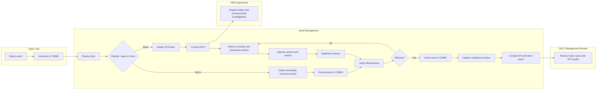

```mermaid
flowchart LR
  %% Swimlane: O&M / Site
  subgraph OM["O&M / Site"]
    A["Detect event"] --> B["Log event in CMMS"]
  end

  %% Swimlane: Asset Management
  subgraph AM["Asset Management"]
    C["Review entry"] --> D{"Classify: major or minor"}
    D -- "Major" --> E["Assign RCA team"]
    D -- "Minor" --> F["Define immediate corrective action"]
    E --> G["Conduct RCA"]
    G --> H["Define corrective and preventive actions"]
    F --> I["Record action in CMMS"]
    H --> J["Approve actions and owners"]
    J --> K["Implement actions"]
    I --> L["Verify effectiveness"]
    K --> L
    L --> M{"Effective?"}
    M -- "Yes" --> N["Close event in CMMS"]
    M -- "No" --> H
    N --> O["Update compliance tracker"]
    O --> P["Compile KPI and trend report"]
  end

  %% Swimlane: HSE
  subgraph HSE["HSE Department"]
    Q["Support safety and environmental investigations"]
  end

  %% Swimlane: CEO / MRC
  subgraph CEO["CEO / Management Review"]
    R["Review major cases and KPI results"]
  end

  %% Cross-lane links
  B --> C
  G --> Q
  P --> R
    
```
