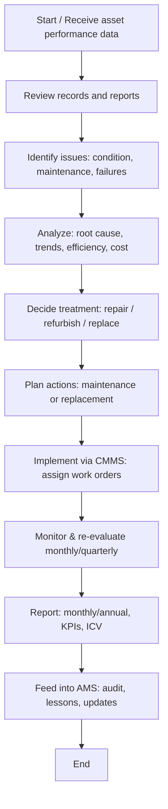

```mermaid
flowchart TD
    A["Start / Receive asset performance data"] --> B["Review records and reports"]
    B --> C["Identify issues: condition, maintenance, failures"]
    C --> D["Analyze: root cause, trends, efficiency, cost"]
    D --> E["Decide treatment: repair / refurbish / replace"]
    E --> F["Plan actions: maintenance or replacement"]
    F --> G["Implement via CMMS: assign work orders"]
    G --> H["Monitor & re-evaluate monthly/quarterly"]
    H --> I["Report: monthly/annual, KPIs, ICV"]
    I --> J["Feed into AMS: audit, lessons, updates"]
    J --> K["End"]
    
```
