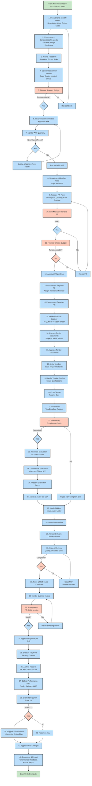

```mermaid
graph TD
    A[Start: New Fiscal Year / Procurement Need] --> B

    %% Procurement Planning
    B[1. Departments Identify Needs<br>Description, Cost, Budget Code] --> C
    C[2. Procurement Consolidates Requests<br>Draft APP, Merge Duplicates] --> D
    D[3. Market Research<br>Suppliers, Prices, Risks] --> E
    E[4. Select Procurement Method<br>Open Tender, Limited, Direct] --> F
    F[5. Finance Reviews Budget] -->|Funds Available?| G{Yes}
    G --> H[6. CEO/Tender Committee Approves APP]
    F -->|No| I[Revise Needs]
    I --> B
    H --> J[7. Monitor APP Quarterly]
    J -->|New Urgent Needs?| K{Yes}
    K --> L[Justify & Approve New Needs]
    L --> H
    K -->|No| M[Proceed with APP]
    M --> N

    %% Purchase Requisition
    N[8. Department Identifies Need<br>Align with APP] --> O
    O[9. Prepare PR Form<br>Description, Quantity, Cost, Timeline] --> P
    P[10. Line Manager Reviews PR] -->|Valid?| Q{Yes}
    Q --> R[11. Finance Checks Budget]
    Q -->|No| S[Revise PR]
    S --> O
    R -->|Funds Available?| T{Yes}
    T --> U[12. Approve PR per DoA]
    T -->|No| S
    U --> V[13. Procurement Registers PR<br>Assign Reference Number]
    V --> W

    %% Tendering/Sourcing
    W[14. Procurement Receives PR] --> X
    X[15. Develop Tender Strategy<br>RFQ, RFP, or Open Tender] --> Y
    Y[16. Prepare Tender Documents<br>Scope, Criteria, Terms] --> Z
    Z[17. Approve Tender Documents] --> AA
    AA[18. Invite Vendors<br>Issue RFQ/RFP/Tender] --> AB
    AB[19. Handle Vendor Queries<br>Share Clarifications] --> AC
    AC[20. Close Tender<br>Receive Bids] --> AD

    %% Evaluation & Award
    AD[21. Open Bids<br>Two-Envelope System] --> AE
    AE[22. Preliminary Compliance Check] -->|Compliant?| AF{Yes}
    AF --> AG[23. Technical Evaluation<br>Score Proposals] --> AH
    AH[24. Commercial Evaluation<br>Compare Offers, ICV] --> AI
    AI[25. Prepare Evaluation Report] --> AJ
    AJ[26. Approve Award per DoA] --> AK
    AK[27. Notify Bidders<br>Issue Award Letter] --> AL
    AL[28. Issue Contract/PO] --> AM
    AE -->|No| AN[Reject Non-Compliant Bids]
    AN --> AK

    %% Delivery, Inspection & Payment
    AM[29. Vendor Delivers Goods/Services] --> AO
    AO[30. Inspect Delivery<br>Quality, Quantity, Specs] -->|Compliant?| AP{Yes}
    AP --> AQ[31. Issue GRN/Service Certificate]
    AP -->|No| AR[Issue NCR<br>Vendor Rectifies]
    AR --> AO
    AQ --> AS[32. Vendor Submits Invoice] --> AT
    AT[33. 3-Way Match<br>PO, GRN, Invoice] -->|Match?| AU{Yes}
    AU --> AV[34. Approve Payment per DoA] --> AW
    AW[35. Execute Payment<br>Banking Channel] --> AX
    AX[36. Archive Records<br>PR, PO, GRN, Invoice]
    AT -->|No| AY[Resolve Discrepancies]
    AY --> AS

    %% Supplier Performance Review
    AX --> AZ[37. Collect Performance Data<br>Quality, Delivery, HSE] --> BA
    BA[38. Evaluate Supplier<br>Score 1-4] -->|Score ≤2?| BB{Yes}
    BB --> BC[39. Supplier on Probation<br>Corrective Action Plan]
    BB -->|No| BD[40. Retain on AVL]
    BC --> BE[41. Approve AVL Changes]
    BD --> BE
    BE --> BF[42. Document & Report<br>Performance Database, Annual Report]

    BF --> C1[End: Cycle Complete]

    %% Styling
    classDef process fill:#BBDEFB,stroke:#333,stroke-width:2px;
    classDef decision fill:#FFCCBC,stroke:#333,stroke-width:2px;
    classDef startEnd fill:#C8E6C9,stroke:#333,stroke-width:2px;
    class A,C1 startEnd;
    class F,P,R,T,AE,AP,AT,BB decision;
    class B,C,D,E,G,H,I,J,K,L,M,N,O,Q,S,U,V,W,X,Y,Z,AA,AB,AC,AD,AF,AG,AH,AI,AJ,AK,AL,AM,AN,AO,AQ,AR,AS,AU,AV,AW,AX,AY,AZ,BA,BC,BD,BE,BF process;
```
