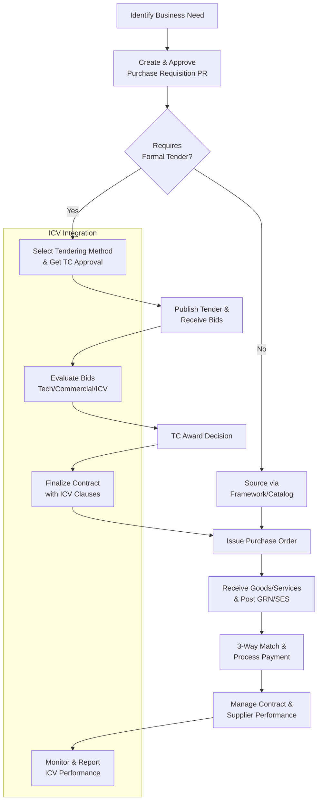

```mermaid
flowchart TD
    A[Identify Business Need] --> B[Create & Approve<br>Purchase Requisition PR];
    B --> C{Requires<br>Formal Tender?};
    C -- No --> D[Source via<br>Framework/Catalog];
    C -- Yes --> E[Select Tendering Method<br>& Get TC Approval];
    E --> F[Publish Tender &<br>Receive Bids];
    F --> G[Evaluate Bids<br>Tech/Commercial/ICV];
    G --> H[TC Award Decision];
    H --> I[Finalize Contract<br>with ICV Clauses];
    D --> J[Issue Purchase Order];
    I --> J;
    J --> K[Receive Goods/Services<br>& Post GRN/SES];
    K --> L[3-Way Match &<br>Process Payment];
    L --> M[Manage Contract &<br>Supplier Performance];
    M --> N[Monitor & Report<br>ICV Performance];

    subgraph ICV Integration
        E
        G
        I
        N
    end;
```
