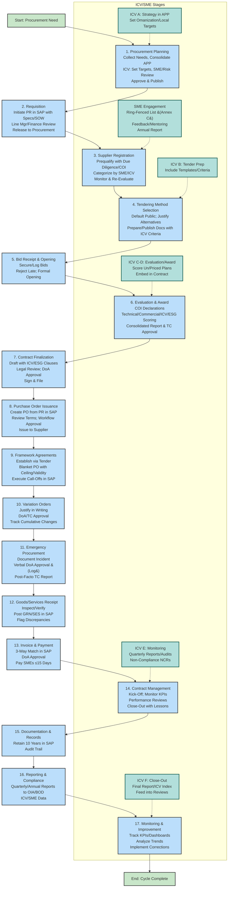

```mermaid
graph TD
    A[Start: Procurement Need] --> B

    %% Procurement Planning
    B[1. Procurement Planning<br>Collect Needs, Consolidate APP<br>ICV: Set Targets, SME/Risk Review<br>Approve & Publish] --> C

    %% Requisition
    C[2. Requisition<br>Initiate PR in SAP with Specs/SOW<br>Line Mgr/Finance Review<br>Release to Procurement] --> D

    %% Supplier Management
    D[3. Supplier Registration<br>Prequalify with Due Diligence/COI<br>Categorize by SME/ICV<br>Monitor & Re-Evaluate] --> E

    %% Tendering / Sourcing
    E[4. Tendering Method Selection<br>Default Public; Justify Alternatives<br>Prepare/Publish Docs with ICV Criteria] --> F
    F[5. Bid Receipt & Opening<br>Secure/Log Bids<br>Reject Late; Formal Opening] --> G

    %% Evaluation & Award
    G[6. Evaluation & Award<br>COI Declarations<br>Technical/Commercial/ICV/ESG Scoring<br>Consolidated Report & TC Approval] --> H

    %% Contract & PO
    H[7. Contract Finalization<br>Draft with ICV/ESG Clauses<br>Legal Review; DoA Approval<br>Sign & File] --> I
    I[8. Purchase Order Issuance<br>Create PO from PR in SAP<br>Review Terms; Workflow Approval<br>Issue to Supplier] --> J

    %% Framework & Variations
    J[9. Framework Agreements<br>Establish via Tender<br>Blanket PO with Ceiling/Validity<br>Execute Call-Offs in SAP] --> K
    K[10. Variation Orders<br>Justify in Writing<br>DoA/TC Approval<br>Track Cumulative Changes] --> L
    L[11. Emergency Procurement<br>Document Incident<br>Verbal DoA Approval &#40;Log&#41;<br>Post-Facto TC Report] --> M

    %% Execution & Monitoring
    M[12. Goods/Services Receipt<br>Inspect/Verify<br>Post GRN/SES in SAP<br>Flag Discrepancies] --> N
    N[13. Invoice & Payment<br>3-Way Match in SAP<br>DoA Approval<br>Pay SMEs ≤15 Days] --> O
    O[14. Contract Management<br>Kick-Off; Monitor KPIs<br>Performance Reviews<br>Close-Out with Lessons] --> P

    %% Reporting & Compliance
    P[15. Documentation & Records<br>Retain 10 Years in SAP<br>Audit Trail] --> Q
    Q[16. Reporting & Compliance<br>Quarterly/Annual Reports to OIA/BOD<br>ICV/SME Data] --> R
    R[17. Monitoring & Improvement<br>Track KPIs/Dashboards<br>Analyze Trends<br>Implement Corrections] --> S

    %% ICV/SME Integration (Overlaid)
    subgraph ICV/SME Stages
        T[ICV A: Strategy in APP<br>Set Omanization/Local Targets] -.-> B
        U[ICV B: Tender Prep<br>Include Templates/Criteria] -.-> E
        V[ICV C-D: Evaluation/Award<br>Score Un/Priced Plans<br>Embed in Contract] -.-> G
        W[ICV E: Monitoring<br>Quarterly Reports/Audits<br>Non-Compliance NCRs] -.-> O
        X[ICV F: Close-Out<br>Final Report/ICV Index<br>Feed into Reviews] -.-> R
        Y[SME Engagement<br>Ring-Fenced List &#40;Annex C&#41;<br>Feedback/Mentoring<br>Annual Report] -.-> D
    end

    S[End: Cycle Complete]

    %% Styling
    classDef process fill:#BBDEFB,stroke:#333,stroke-width:2px;
    classDef decision fill:#FFCCBC,stroke:#333,stroke-width:2px;
    classDef startEnd fill:#C8E6C9,stroke:#333,stroke-width:2px;
    classDef icv fill:#B2DFDB,stroke:#004D40,stroke-width:2px;
    class A,S startEnd;
    class B,C,D,E,F,G,H,I,J,K,L,M,N,O,P,Q,R process;
    class T,U,V,W,X,Y icv;
```
